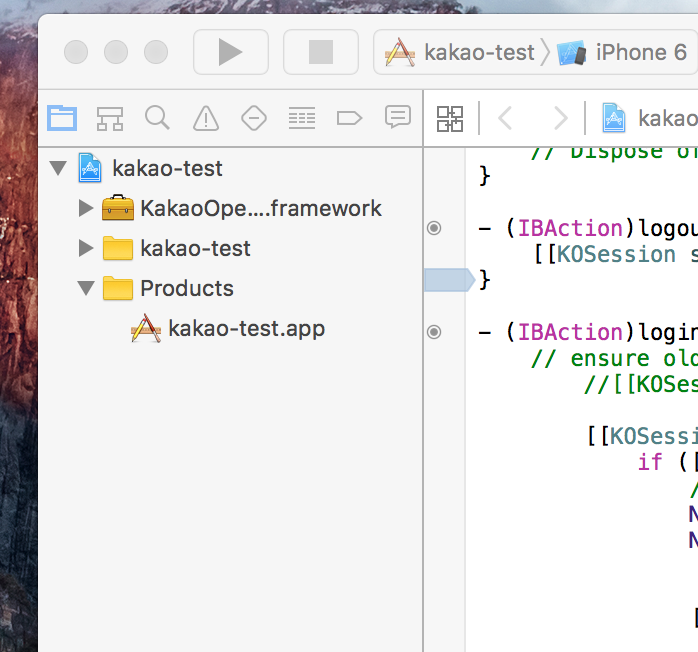

# React Native : 카카오 로그인 (kakao login)

React native 0.41 이상을 지원하는 카카오 로그인 모듈입니다.

Original: https://github.com/helpkang/react-native-kakao-login.git

로부터 파생하였습니다.

[카카오 로그인] (https://developers.kakao.com/docs)


**Note**: react-native 카카오 로그인 샘플 프로젝트 포함 되어 있고 참조하면 됩니다.

## 사용법


```js
import React, { Component } from 'react';
import {
  AppRegistry,
  StyleSheet,
  Text,
  View,
  TouchableOpacity,
} from 'react-native';

import KakaoLogin from "react-native-kakao-login"

console.log('kakaologin', KakaoLogin)

class exampleKakaoLogin extends Component {
  async login(){
    try{
      var data = await KakaoLogin.login()
      console.log('kakao data', data)
    }catch(e){
      // if(e.code === 'KAKAO_LOGIN_CANCEL'){//사용자가 취소
      // }
      // console.log('kakao error receive......', JSON.stringify(e) )
      console.log('kakao error receive......', e.code )
    }
  }

  async logout(){
      var data = await KakaoLogin.logout()
      console.log('kakao data', data)
  }

  render() {
    return (
      <View style={styles.container}>
        <TouchableOpacity onPress={()=>this.login()}>
          <Text>카카오로그인</Text>
        </TouchableOpacity>
        <TouchableOpacity onPress={()=>this.logout()}>
          <Text>카카오로그아웃</Text>
        </TouchableOpacity>

      </View>
    );
  }
}

const styles = StyleSheet.create({
  container: {
    flex: 1,
    justifyContent: 'center',
    alignItems: 'center',
    backgroundColor: '#F5FCFF',
  },
});

AppRegistry.registerComponent('exampleKakaoLogin', () => exampleKakaoLogin);
```

### 로그인 리턴 값

* accessToken
* id
* nickname
* profile_image

## 설치
* install
```
npm i -S react-native-kakao-login-rn0.41
```

* native setup
```
rnpm link react-native-kakao-login-rn0.41
```

카카오 페이지를 참조해서 ios, android native 설정 하거나 샘플 참조

## 안드로이드 설치
### android/build.gradle 에 아래 라인 추가

maven { url 'http://devrepo.kakao.com:8088/nexus/content/groups/public/' }
```gradle
allprojects {
    repositories {
        mavenLocal()
        jcenter()
        maven { url 'http://devrepo.kakao.com:8088/nexus/content/groups/public/' } //<--추가
        maven {
            // All of React Native (JS, Obj-C sources, Android binaries) is installed from npm
            url "$rootDir/../node_modules/react-native/android"
        }
    }
}
```

### MainApplication.java에 해당 파일 추가

import com.helpkang.kakaologin.KakaoLoginPackage;

new KakaoLoginPackage()
```java
import com.helpkang.kakaologin.KakaoLoginPackage;//<--추가


public class MainApplication extends Application implements ReactApplication {

  private final ReactNativeHost mReactNativeHost = new ReactNativeHost(this) {
    @Override
    public boolean getUseDeveloperSupport() {
      return BuildConfig.DEBUG;
    }

    @Override
    protected List<ReactPackage> getPackages() {
      return Arrays.<ReactPackage>asList(
          new MainReactPackage(),
              new KakaoLoginPackage()//<---추가
      );
    }
  };

  @Override
  public ReactNativeHost getReactNativeHost() {
      return mReactNativeHost;
  }
}
```


[카카오 android 앱등록](https://developers.kakao.com/docs/android#사용자-관리-앱-연결)


## ios 설치
### AppDelegate.m 에 아래 라인 추가
```obj-c
#import <KakaoOpenSDK/KakaoOpenSDK.h>

.... 중략 .....
- (BOOL)application:(UIApplication *)application openURL:(NSURL *)url
  sourceApplication:(NSString *)sourceApplication
         annotation:(id)annotation {

  if ([KOSession isKakaoAccountLoginCallback:url]) {
    return [KOSession handleOpenURL:url];
  }
  return NO;

}

- (BOOL)application:(UIApplication *)application openURL:(NSURL *)url
            options:(NSDictionary<NSString *,id> *)options {

  if ([KOSession isKakaoAccountLoginCallback:url]) {
    return [KOSession handleOpenURL:url];
  }
  return NO;

}

- (void)applicationDidBecomeActive:(UIApplication *)application
{
  [KOSession handleDidBecomeActive];
}
.... 중략 .....
```

### 카카오 라이브러리 등록
xcode에서 프로젝트를 열고
open node_modules/react-native-kakao-login/KakaoSDK
드래그 & 드롭해서  KakaoOpenSDK.framework을 해서 넣는다.



[카카오 ios 앱등록](https://developers.kakao.com/docs/ios#시작하기-앱-생성)


## Copyright and license

MIT license
